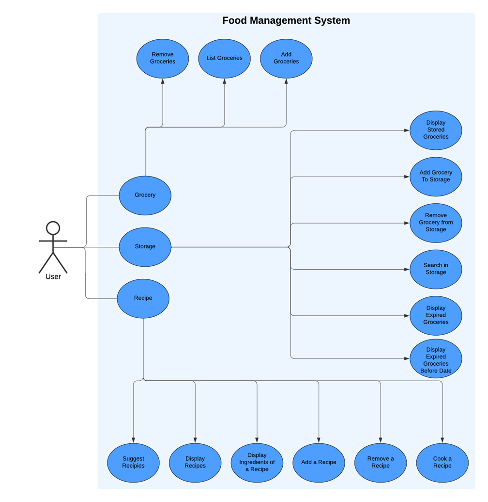

# Portfolio project IDATT1003
This file uses Mark Down syntax. For more information see [here]([x]https://www.markdownguide.org/basic-syntax/).

[//]: # (TODO: Fill inn your name and student ID)

STUDENT NAME = Yazan Zarka  
STUDENT ID = 530542

## Requirements

### Run `mvn --version`
    
[//] Make sure you have the following installed:
* `Apache Maven 3.9.8 `
* `Oracle OpenJDK 23`

## Project description

[//] Food Management System is a system that is built with scalability in mind. The system is built to manage groceries and recipes. The system is built with the following features:

## Project structure

[//] All modules follow the following structure:
* Module
    * src
        * main
            * java
                * org.ntnu.packageName
                  
        * test
            * java
                * org.ntnu.packageName

[//] Food Management System is built modular with SOLID principles without Dependency Injection. The system is divided into the following modules:

* Application (Main Module)
    * Main - The main class of the system
    * Menus - A directory containing the menu contexts of the system and commands
    * Commands - A directory containing the commands of the system
    * Core - A directory containing the Bootstrapper and the Application Context
    * Containers - A directory containing the Food Storage Containers of the system.
* Food - Contains the classes for managing food items 

* Console - Contains the classes for managing the console input and output
* Unit - Contains SI units

## Link to repository

[//] https://github.com/NTNU-IDI/idatt1003-mappe-2024-yazanzarka1.git

## How to run the project

[//] you run the project by running the following command in the terminal:
` ./BuildAndRun.ps1 
`

## How to run the tests

[//] you run the tests by running the following command in the terminal:
`  ./RunTests.ps1 
`

## References

* [Java Documentation](https://docs.oracle.com/en/java/)
* [Maven Documentation](https://maven.apache.org/guides/index.html)
* [JUnit 5 Documentation](https://junit.org/junit5/docs/current/user-guide/)
* Cay S. Horstmann, core java fundamentals volume 1, 2007
* https://docs.oracle.com/javase/8/docs/api/java/util/stream/Stream.html

